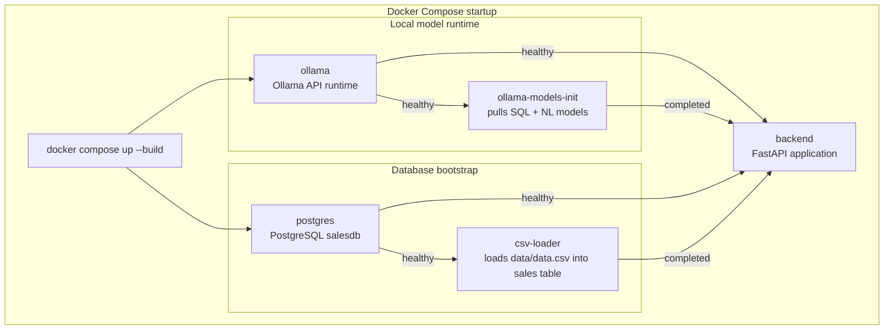
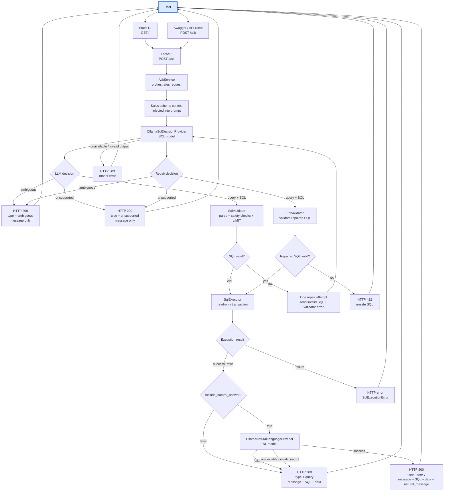
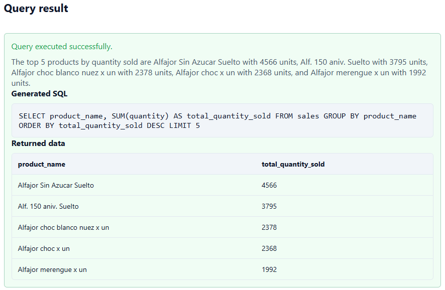
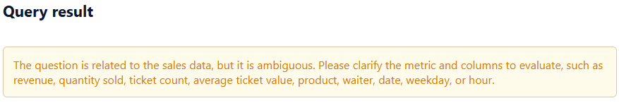
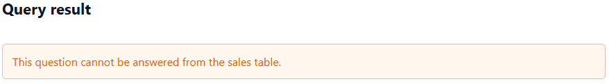

# Local Sales Text-to-SQL

Local text-to-SQL application for a single sales CSV dataset. The stack loads `data/data.csv` into PostgreSQL, converts natural-language questions into SQL with a locally hosted Ollama model, validates and executes the SQL, and optionally uses a second local model to turn successful query results into a short natural-language answer.

## Features

- Loads `data/data.csv` into PostgreSQL on startup.
- Generates PostgreSQL `SELECT` queries from natural-language questions.
- Injects dataset schema context and business mappings into the SQL prompt.
- Validates generated SQL before execution and performs one bounded repair attempt when validation fails.
- Returns three logical outcomes: `query`, `ambiguous`, and `unsupported`.
- Optionally generates a natural-language answer after a successful query.
- Serves a small static UI from the FastAPI app.
- Exposes Swagger/OpenAPI docs for direct API testing.
- Runs locally with Docker Compose and local Ollama models only.

## Architecture

### Startup / infrastructure



### User interaction



The application is composed of a FastAPI backend, PostgreSQL, and an Ollama runtime. `OllamaSqlDecisionProvider` generates SQL or a domain decision, `SqlValidator` checks safety before execution, and `SqlExecutor` runs validated statements against PostgreSQL. For successful query responses, `OllamaNaturalLanguageProvider` can make a second local model call to summarize the returned rows. The static frontend is served directly by FastAPI and calls the same `/ask` endpoint used by API clients.

## Requirements

- Docker Desktop, or Docker Engine with the Docker Compose V2 plugin (`docker compose`, not the legacy `docker-compose` standalone command).
- Python `3.12+` only if running the backend directly outside Docker; the container image already uses Python `3.12`.
- Enough local CPU/RAM for the configured Ollama models.
- Network access on the first run so Ollama can download model weights.

The Compose stack uses PostgreSQL `16` and depends on Compose features such as conditional service startup (`service_healthy` and `service_completed_successfully`). Docker Desktop is the simplest supported setup because it already includes Docker Engine, the Docker CLI, and Docker Compose V2.

## Run Locally

Start the full stack:

```bash
docker compose up --build
```

Stop the containers:

```bash
docker compose down
```

Stop the containers and remove persisted Docker volumes:

```bash
docker compose down -v
```

The first startup can take several minutes because the Ollama init container downloads and preloads the configured SQL and natural-language models. Subsequent startups are faster because the `ollama_data` volume is reused. The first request after startup can also be slower while a local model becomes warm in memory; later requests are usually faster while the model remains loaded.

PostgreSQL data is stored in the `postgres_data` volume. The CSV loader is a one-shot container that recreates and reloads the `sales` table from `data/data.csv` during startup.

## Access

- Demo UI: `http://localhost:8000/`
- Swagger/OpenAPI docs: `http://localhost:8000/docs`
- API health: `http://localhost:8000/health`
- Database health: `http://localhost:8000/db-health`
- Ollama API: `http://localhost:11434`
- PostgreSQL: `localhost:5432`

## Demo

### Query

`What are the top 5 products by quantity sold?`



### Ambiguous

`What is the best product?`



### Unsupported

`What is the best animal in the world?`



## Configuration

Configuration is read from environment variables. When running with Docker Compose, values come from shell variables or `.env` if present; otherwise the defaults in `docker-compose.yml` are used. When running Python directly outside Compose, `app/config/settings.py` provides the same application defaults.

| Variable | Default | Purpose |
| --- | --- | --- |
| `DB_HOST` | `localhost` outside Compose, `postgres` in Compose | PostgreSQL host |
| `DB_PORT` | `5432` | PostgreSQL port |
| `DB_NAME` | `salesdb` | Database name |
| `DB_USER` | `postgres` | Database user |
| `DB_PASSWORD` | `postgres` | Database password |
| `OLLAMA_HOST` | `http://localhost:11434` outside Compose, `http://ollama:11434` in Compose | Ollama endpoint |
| `OLLAMA_MODEL_SQL` | `qwen2.5-coder:3b` | Local model used for SQL generation and SQL repair |
| `OLLAMA_MODEL_NL` | `llama3.2:3b` | Local model used for optional natural-language summaries |
| `OLLAMA_TIMEOUT_SECONDS` | `300` | Timeout for Ollama calls |
| `OLLAMA_TEMPERATURE_SQL` | `0` | Deterministic SQL generation |
| `OLLAMA_TEMPERATURE_NL` | `0.2` | Low-temperature natural-language generation |
| `OLLAMA_TOP_P` | `1` | Shared nucleus-sampling setting |
| `OLLAMA_NUM_PREDICT_SQL` | `512` | Output budget for SQL decisions and repairs |
| `OLLAMA_NUM_PREDICT_NL` | `512` | Output budget for natural-language answers |

The Ollama configuration is separated by task because the models have different responsibilities. SQL generation uses temperature `0` to favor validity, repeatability, and lower risk of invented structures. Natural-language generation runs only after a successful query and uses a slightly higher, but still low, temperature to improve readability without encouraging hallucinations. Separate `num_predict` values keep room for structured SQL decisions while allowing final answers to remain bounded independently.

The default model names are configurable rather than hard-coded. Users can replace `OLLAMA_MODEL_SQL` and `OLLAMA_MODEL_NL` with other Ollama model names that better fit their machine or quality needs, as long as the selected models are available in Ollama and behave correctly with this application's generation flow. See the official [Ollama API documentation](https://docs.ollama.com/api) and [Ollama model library](https://ollama.com/library) when selecting alternatives.

Request-level row count is not an environment variable. Clients send `max_rows` per `/ask` request; the API accepts `1` through `100`, defaults to `50`, and the validator caps generated SQL to the backend maximum.

## API Usage

`POST /ask`

Example request:

```json
{
  "question": "What are the top 5 products by quantity sold?",
  "max_rows": 50,
  "include_natural_answer": true
}
```

Request fields:

- `question`: required non-blank natural-language question.
- `max_rows`: optional maximum returned rows, from `1` to `100`; defaults to `50`.
- `include_natural_answer`: optional boolean; defaults to `true`. When `false`, the successful query response skips the second model call.

Successful query response shape:

```json
{
  "type": "query",
  "message": "Query executed successfully.",
  "sql": "SELECT ...",
  "data": [],
  "natural_message": "..."
}
```

Response types:

- `query`: the question is answerable, SQL was validated and executed, and `data` contains the returned rows.
- `ambiguous`: the question is about the sales domain but needs clarification, such as an undefined metric in "best product".
- `unsupported`: the question cannot be answered from the available dataset/schema.

`natural_message` is populated only for successful query responses when natural-language generation is enabled and succeeds. To keep those summaries concise, the natural-language provider is given at most the first five returned rows to mention explicitly; when more rows were returned, it is instructed to add a short `and N more returned rows` suffix instead of listing every row. If that second model call fails, the API still returns the validated SQL and data with `natural_message: null`.

## Design Decisions and Trade-Offs

### Local models and portability

The default models were selected by task fit. `qwen2.5-coder:3b` is a code-oriented model, which makes it a practical default for SQL generation and repair, while `llama3.2:3b` is an instruction-tuned text model suited to short summaries and natural-language responses. The SQL model is intentionally small so the project is more likely to run on personal machines. This matches the assessment goal of local reproducibility and avoids dependency on external model APIs. A larger local SQL model can improve SQL quality, but it increases model download size, memory usage, and latency.

Smaller models are less reliable on SQL generation, so the system compensates with:

- schema injection and explicit business mappings,
- strict prompts and few-shot examples,
- deterministic or low-temperature inference,
- strict output contracts,
- SQL validation before execution,
- one bounded repair attempt,
- read-only execution controls and result limits.

The SQL prompt explicitly separates:

- `query`: answerable questions that can be translated into SQL,
- `ambiguous`: in-domain questions that need clarification,
- `unsupported`: questions outside the dataset or schema.

The SQL model contract is intentionally minimal: it returns only SQL, `AMBIGUOUS`, or `UNSUPPORTED`, and the application maps that output into its internal typed response model. A JSON contract would be more expressive, but it would also ask more of a small local model and add complexity that is not needed for the current flow. Including simple messages in the application code also makes those responses more stable.

The current integration calls Ollama directly through small provider classes instead of adding a broader LLM orchestration layer. That keeps a short workflow easier to read, test, and debug. If the project later grew into many model steps, routing rules, retrieval stages, tools, or evaluation flows, introducing a dedicated orchestration layer could be a good option.

### Optional natural-language generation

Natural-language answers are optional because they require a second local model call and add latency. The second model is only used after SQL validation and successful execution, so it cannot affect database safety. Disabling `include_natural_answer` returns the same SQL and data more quickly.

### SQL safety

SQL safety is enforced in code, not delegated to the model. The validator uses `sqlglot` to parse PostgreSQL SQL, rejects comments and multiple statements, allows only `SELECT` shapes (including safe set operations), rejects mutating/admin expressions and locking clauses, restricts referenced tables to the `sales` allowlist, and injects or reduces `LIMIT` to respect `max_rows` and the backend cap of `100`.

The table allowlist is validated in code. Column names are constrained through the prompt and schema context rather than a separate column allowlist in the validator. PostgreSQL execution also runs inside a read-only transaction with a statement timeout.

### UI scope

The frontend is intentionally static and small. It exists to demonstrate the user workflow, not to serve as a production frontend architecture. It shows the dataset schema, question input, `max_rows`, natural-language toggle, loading state, generated SQL, returned rows, semantic response states, and an "ask another question" flow.

## Limitations

- V1 is optimized for one CSV file and one `sales` table.
- It does not infer a relational model from multiple CSV files or support joins across a broader schema.
- SQL quality depends on the selected local model and available machine resources.
- Running two local models can require significant RAM/CPU and can be slow on modest machines.
- `First startup and first request can be noticeably slower because models must be downloaded and/or warmed.`
- Column validity is guided by prompts rather than enforced by a dedicated column allowlist validator.
- The static UI is intentionally basic.

## Scalability Considerations

The current version is intentionally built around one CSV file and one SQL table. If the project needed to grow to more datasets or tables, the ingestion process should become more explicit: keep metadata about available tables, columns, and relationships, and provide the model only with the schema information that is relevant to each question instead of sending everything every time.

If usage increased, the FastAPI application could stay stateless and run in multiple instances behind a load balancer. The model runtime could also be moved to dedicated machines with more CPU, RAM, or GPU capacity, because local model inference is the slowest part of the request.

On the database side, the next practical improvements would be connection pooling, indexes for frequently filtered or grouped columns, query timeouts, and limits on the amount of data returned. For operations, the service would benefit from structured logs, metrics, and clear timeout/error handling for both database and model failures.

## Project Structure

```text
app/
  api/          FastAPI routes and exception handlers
  config/       settings and logging configuration
  db/           PostgreSQL connection helper
  llm/          Ollama client and model providers
  prompts/      SQL and natural-language prompts
  schemas/      request/response and LLM schemas
  services/     orchestration, SQL validation, SQL execution
  static/       HTML, CSS, and vanilla JavaScript UI
data/
  data.csv      source dataset
infra/
  db/           CSV loading script
  ollama/       model initialization script
tests/          backend test suite
docker-compose.yml
Dockerfile
```
